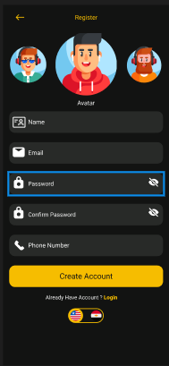
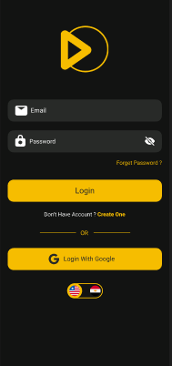
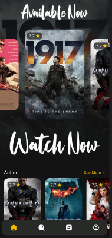
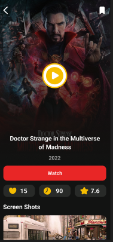
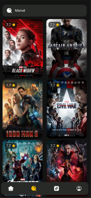
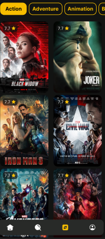
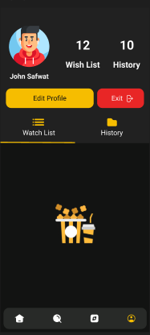
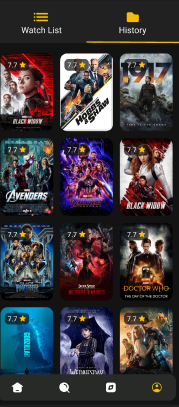
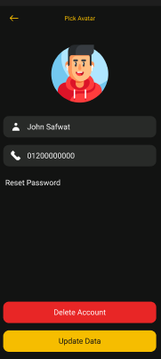
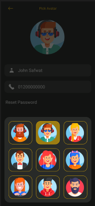

# 🎬 Moves Final Project

A robust Flutter application built with a feature-driven architecture, integrating Firebase for backend services and BLoC/Provider for state management.

---

## 📸 Screenshots

### 1. Onboarding & Authentication
The user journey starts with registration and secure access to the platform.

<p align="center">
  
  
</p>

### 2. Core Experience
Exploring, searching, and viewing movie details.

<p align="center">
  
  
</p>
<p align="center">
  
  
</p>

### 3. User Profile & Personalization
Managing account details and content lists.

<p align="center">
  
  
  
</p>
<p align="center">
  
</p>

---
## 📂 Project Architecture

The project follows a **Feature-based Clean Architecture** to ensure maintainability:

- **`core/`**: Contains shared utilities, themes, and global configurations.
- **`features/`**: The heart of the app, divided by functionality:
    - **`auth/`**: Handles Login, Registration, and Password Recovery.
        - `data/`: Repositories and data sources.
        - `presentation/`: UI screens.
        - `providers/`: Logic and state management for authentication.
    - **`onboarding/`**: Initial user walkthrough experience.
    - **`home/`**: Main dashboard and navigation.
    - **`details/`**: Detailed views for app content.
    - **`edit_profile/`**: User profile management.
- **`widgets/`**: Reusable UI components used across multiple features.

---

## 🚀 Key Technologies

- **State Management**: `flutter_bloc` & `provider`.
- **Navigation**: `auto_route` (Generator-based routing).
- **Dependency Injection**: `get_it` & `injectable` (Setup in `di.dart`).
- **Backend**: Firebase Auth & Cloud Firestore.
- **Networking**: `dio` with `pretty_dio_logger`.
- **UI Responsiveness**: `flutter_screenutil`.

---

## 🛠️ Getting Started

### 1. Code Generation
This project uses `build_runner`. After adding new routes or injectable services, run:
```bash
flutter pub run build_runner build --delete-conflicting-outputs